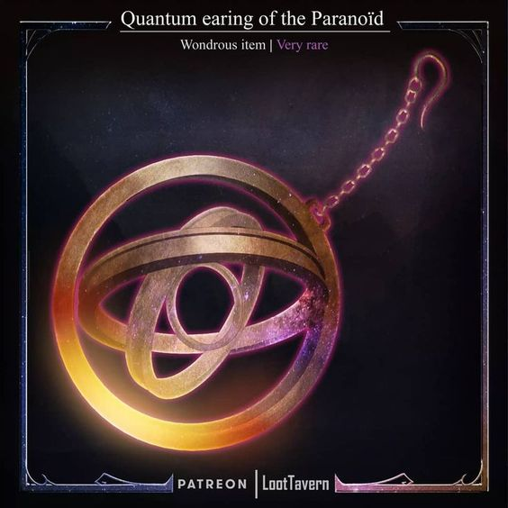
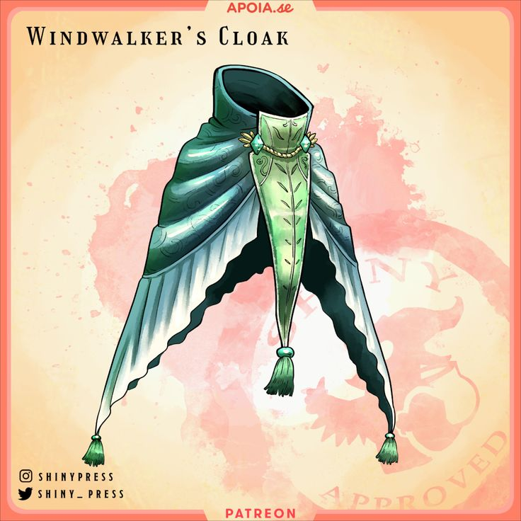
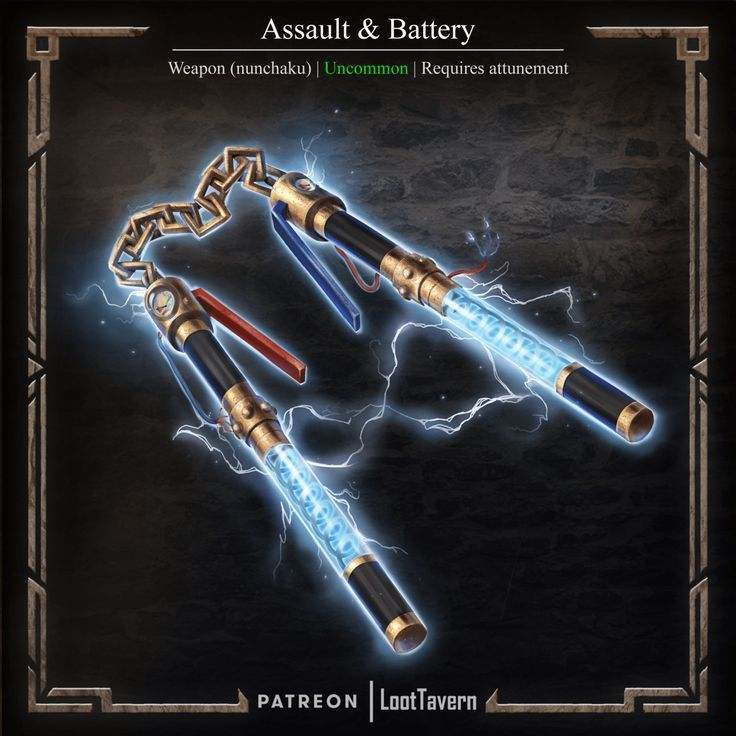
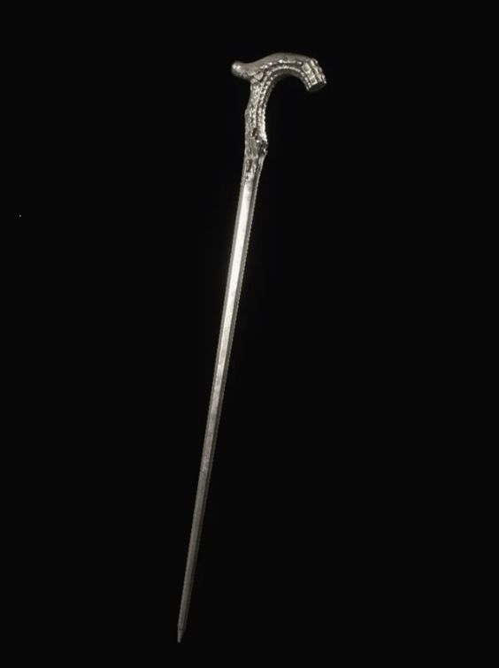
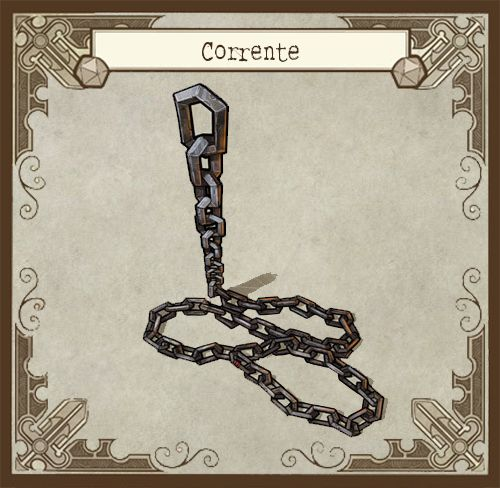
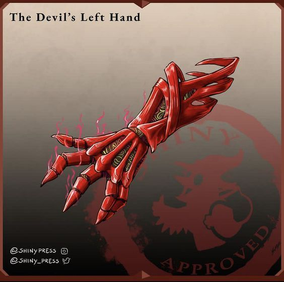
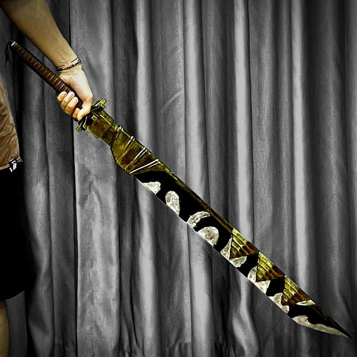
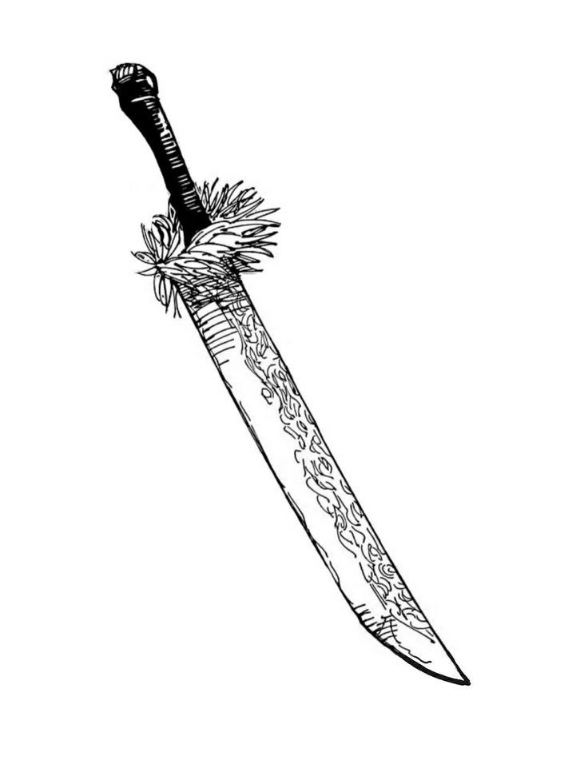
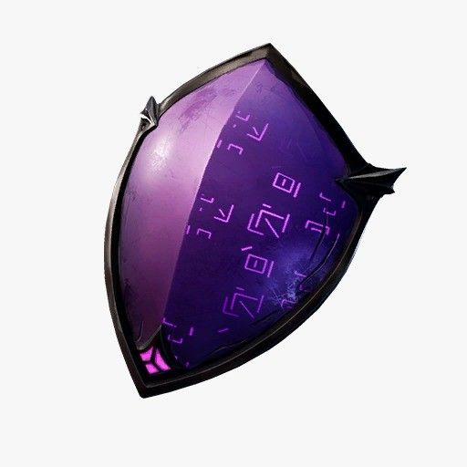
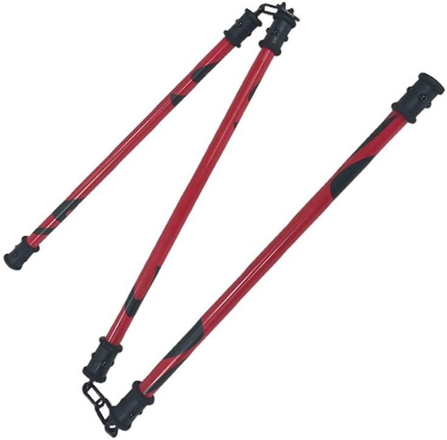

# Como Funcionam as Armas de Grau Especial 

diferente do que a grande maioria das pessoas pensam armas de grau especial nao sao necessariamente itens extremamente poderosos, uma arma de grau especial e uma arma que possui uma tecnica complexa armazenada dentro dela podendo ate mesmo haver condicoes, diferente das habilidades e tecnicas o portador do artefato nao consegue criar condicoes novas para a arma, elas so podem ser criadas no momento de sua forja

e pressumivel que artefatos de grau especial nao caiam de arvore e ao mesmo tempo sao almejados por muitos feiticeiros, para se obter um item de grau especial da ordem e necessario requisitar-lo, caso ele esteja no estoque sera avaliado o motivo e a necessidade, caso esteja tudo confere o pedido sera aprovado e a arma sera enviada em seguranca para o feiticeiro, em termos mecanicos voce solicita a arma no meio da campanha e ela ira ou nao ser entregue e caso voce tenha a categori= da arma vaga as suas chances de sucesso sao maiores

a grande maioria dos artefatos de grau especial tem o status de artefato unico, isso significa que so existe uma arma dessa no mundo logo apenas um personagem pode a usar, existem variantes de armas de grau especial mas e muito dificil fabricar-las em serie

devido a sua complexidade estrutural artefatos de grau especial nao podem receber novas modificacoes e em sua grande maioria sao itens categoria IV entretanto mesmo todos tendo a mesma categoria eles podem ser nivelados em sua qualidade, muitos fatores influenciam no quao poderoso e um item de grau especial tais como: modo de fabricacao, material usado, ferramentas usaddas e a propria habilidade do artesao que fez o equipamento, por isso a qualidade das armas de grau especial fica nivelada em:

desconhecida. esta qualidade indica que o item de grau especial ainda nao despertou sua natureza verdadeira e por isso nao pode ser nivelado, normalmente esses itens sao menos requisitados do que os demais e por isso muitos agentes de patente baixa os usam ja que sao bem acessiveis

comum. podem ate receber o nome especial mas comparados com as outros artefatos de grau especial ficam um pouco atras e deixam a desejar portando efeitos bem medianos, normalmente usam material de feiticeiros de grau 3 e 2 ou todos os moradores de um predio tem sentimentos negativos sobre esse objeto

rara. itens mais poderosos e que podem fazer a diferenca em um combate, seus materiais sempre sao feiticeiros de grau 1 pra cima ou recebem emocoes negativas de uma cidade inteira, esses itens ja sao mais dificeis de serem solicitados

lendaria. os objetos mais poderosos e bem guardados da ordem, sendo usados pouquissimas vezes e em apenas em casos de extrema necessidade chegando a um ponto que essas armas sempre estao nos armazens da ordem e raramente nos bolsos de um feiticeiro mesmo aqueles de grau especial, essas armas foram feitas de material de feiticeiros extramamente poderosos ou passaram por processos de forja muito complexos ou recebem emocoes negativas de uma parte da populacao mundial

como ja se deve imaginar para usar itens de grua especial e necessario muita habilidade, todos os itens de grau especial possuem algum tipo de requisito, podendo ser um grau de treinamento em uma pericia ou algo mais especifico

## Amplificador de Arquimedes

    status
    peso 1
    tipo - item amaldicoado
    categoria IV
    raridade: comum
    requisito: veterano em ocultismo

    um colar com um pingente de multiplos discos, quando e ativado com uma acao padrao e 5PE seus aneis comeecam a girar em diferentes direcoes e ele flutua levemente, a energia amaldicoada do portador e coletada, amplificada e devolvida para ele, enquanto o amplificador estiver ativo recebe +5 na sua DT de ritual, manter-llo ativado requer sustencao (1PE por rodada)
## Asa de Mariposa

    status:
    peso 1
    tipo: item amaldicoado
    categoria IV
    raridade: comum
    requisito: veterano em acrobacias

    um manto verde com formato incomum, ele possui uma tecnica de transmutacao de vento que aumenta as capacidade de movimentacao de seu portador, ter o manto equipado aumentar em 6m seu deslocamento

    planar - pode planar no ar com deslocamento de voo de 15m mas desce 1,5m toda rodada, por padrao ter o manto equipado te torna imune a quedas

    double jump (1PE) - pode dar um segundo pulo no ar assim pulando o dobro do seu deslocamento de salto
## Bateria de Assalto

    status
    peso 1
    dano 2d8 choque
    critico 17
    tipo: arma leve
    categoria IV
    raridade: rara

    um nunchaku com uma aparencia que lembra uma bateria, ele possui uma tecnica de transmutacao de eletricidade e pode causar ataques rapidos devido a sua alta voltagem

    conducao(3PE) ao acertar um inimigo voce pode conduzir a descarga eletrica para todos ao redor dele, todos os seres em um raio de 3m a quem voce atacou sofrem o mesmo dano

    alta voltagem(2PE) ao acertar um ataque com a bateria de assallto voce pode reutilizar a carga dela para lancar um segundo ataque e caso acerte este segundo ataque pode executar outro pagando o custo de PE novamente, porem a cada ataque acertado voce recebe -2 no teste de ataque mas enquanto continuar acertando voce nao ira parar de atacar
## Canção Melancólica

    status
    peso 1
    tipo - item amaldicoado
    categoria IV
    qualidade: lendaria
    requisito: expert em ocultismo

    uma bengala de madeira com escritos sumerianos, ela possui uma tecnica de shikigamis feitos de um liquido preto incomum, um detalhe e que a forca dos shikigamis depende do quao refinada e a energia amaldicoada do portador deste item, os shikigamis sao vulneraveis a fogo e caso sejam mortos ira levar 48 horas para retornarem, em contrapartida ambos shikigamis podem ser usados ao mesmo tempo

    invocar grifo (10PE / acao completa)
    PV 60/60 def 40 RD 5
    AGL 4 INT 2 VIG 2 PRE 4 FOR 2
    tamanho: medio | deslocamento: 18m voo

    ACOES:
    garras 3d6+10 corte | 19 | corpo a corpo | 4d20 + ocultismo

    HABILIDADES:
    raio roxo - padrao: dispara um raio roxo na direcao de um inimigo em alcance medio causando 8d6 eletricidade (teste de fortitude contra DT de ritual do conjurador reduz a metade) caso um ser falhe nesse teste fica vulneravel por 1 rodada alem de sofrer o dano completo

    sobrecarga - completa: o grifo pode acumular eletricidade para aumentar seu poder de ataque, durante 3 rodadas seus ataques com a garra recebem +3d8 eletricidade e seu raio roxo pode ser usado contra 3 alvos simultaneos

    PERICIAS:
    reflexos +15 vontade +15 fortitude +5 percepcao +15

    ---

    invocar pantera (10PE / acao completa)
    pv 100/100 def 35 RD 10
    AGL 3 INT 1 VIG 4 PRE 1 FOR 4
    tamanho: grande | deslocamento: 12m
    ACOES:
    garras 3d6+10 corte | 19 | corpo a corpo x2 | 4d20 + ocultismo
    mordida 4d12+10 perfuracao | 19 | 4d20 + ocultismo

    HABILIDADES:
    movimento bestial: a pantera ignora penalidades de deslocamento por terreno dificl, ao escalar e furtividade

    montaria: a pantera pode ser usada como uma montaria podendo carregar no maximo uma pessoa mas perde seu movimento bestial enquanto carrega alguem

    mordida profunda: ao usar o ataque da mordida contra um ser pode executar um agarrao como acao livre usando a rolagem de ataque, precisa gastar uma acao padrao toda rodada para manter o inimigo preso mas pode rolar novos testes de luta para arrastar-lo pelo cenario

    PERICIAS:
    reflexos +10 vontade +5 fortitude +15 furtividade +15 atletismo +15
## Corrente de Mil Léguas

    status
    peso: 1
    dano: 2d8 impacto
    critico: 19
    categoria: IV
    tipo: item amaldicoado de qualidade rara
    requisito: veterano em luta

    um pequeno rolo de corrente com um peso em uma ponta e um pequeno gancho na outra que possui uma tecnica de conjuracao que faz com que ela se extenda, esta corrente normalmente e usada em conjunto com outra arma, algumas armas nao podem ser presas na corrente como uma soqueira

    extensao: pode gastar uma acao de movimento para prender uma arma de uma mao ou leve no gancho da corrente, ao prender a corrente em uma arma corpo a corpo seu alcance passa a ser longo tambem podendo acertar alvos em alcance extremo mas com -5 no teste, voce pode tambem atacar com ponta pesada da corrente causando 2d8 impacto

    balanco de ataque: pode gastar 2PE para balancar a corrente de modo que a arma presa acerte dois alvos em alcance longo, saiba que deve ser possivel balancar a arma de um alvo para o outro e os dois devem estar a pelo menos 18m um do outro

    esta e uma arma unica
## Palma Demoniaca

    status
    peso 4
    dano - leia descricao
    critico 17/x3
    tipo - arma pesada
    categoria IV
    qualidade: rara
    requisito: artista marcial e proficiencia com armas pesadas e expert em luto e treinado em vontade

    um par ne manoplas vermelhas que tomam conta dos antebracos inteiros de quem as estiver usando, devido ao seu peso e tamanho as devil palms podem se transformar em dois braceletes vermelhos (mas seu peso nao muda) esta arma torna seus ataques desarmados letais e aumenta seu dano de dano em uma categoria acima (d6 -> d8, d8 -> d10, d10 -> d12) alem de aumentar em +2d o dano de seus ataques desarmados e possibilitando causar danos de corte ao invez de impacto se usar as garras, esta arma possui um motor de energia reversa que revitaliza ou recupera a energia amaldicoada do portador a cada ataque alem de dar a eles uma aura avermelhada

    impregnacao. aparentemente um feiticeiro que usou essa arma a impregnou com seu odio a tornando muito mais violenta do que ja era, veja a habildiade: demonio carmesim

    caçada sangrenta - ao inflingir dano com as palmas do demonio em um ser voce pode escolher entre recuperar 2PE ou 5PV, caso seja um acerto critico os valores sao dobrados

    energia reversa - pode pagar 2PE para recuperar 2d8+2 seguindo as regras de energia reversa

    demonio carmesim - essas manoplas carregam um odio descomunal, so de ter-las em suas maos ja causa arrepios e aqueles de mente fraca nem conseguem usar essa arma (dai vem o requisito do treinamento em vontade) mas voce pode absorver todo esse odio para si, gaste uma acao padrao para encravar uma das garras em seu coracao pra absorver todo o odio dessa arma, ate o final do combate voce ira receber +5 em ataque, dano, defesa e RD e sempre que usar a acao agredir voce pode atacar mais uma vez o mesmo alvo entretanto seu odio e imparavel, se passar uma rodada sem causar dano a nenhum ser voce ira sfrer 8 dano mental, se entrar em enlouquecendo com esse modo ativado voce ira sempre atacar o ser mais proximo de voce
## Dragonbone
 

    status:
    peso 2
    dano 3d10 corte
    critico 17/x3
    categoria IV
    tipo: arma de uma mao
    qualidade: rara
    requisito: expert em luta

    uma katana com a lamina negra e com algumas faixas enroladas nela, ela possui uma tecnica de aucmulacao e dispercao de energia sinetica assim sendo capaz de causar danos devastadores, esta arma possui um funcionamento especial onde ela acumula cargas de acordo com seus acertos criticos, para cada acerto critico voce recebe uma carga podendo acumular ate no maximo 3 cargas

    aparar (3PE e 1 carga) ao sofrer um ataque e usar a reacao de bloqueio voce consegue aparar o golpe recebido, role o dano da arma (sem critico) e some no seu valor de bloqueio

    bone breaker (5PE) ao realizar um ataque voce pode ativar a tecnica da dragonbone para causar um estrago em seu alvo, para cada carga acumulada seu multiplicador de crit aumenta em +1x, caso voce use esta habilidade e nao execute uma acerto critico ela falha e voce recupera os PE, apos usar as cargas da arma sao zeradas
## Katana Divisora De Almas 

    status
    peso: 2
    dano: 3d10
    critico: 17
    tipo: arma de uma mao agil de qualidade rara
    categoria: IV
    requisito: veterano em luta

    Uma katana especial, a qual é capaz de ignorar o físico e partir a própria alma, dilacerando-a. Entretanto, para usá-la efetivamente é necessário ser capaz de perceber o traçado da alma, caso seja veterano em luta pode usar a divisora de almas com apenas uma mao

    corte metafisico: todos os ataques com a divisora de almas tem metade do seu dano ignorando RD, alem disso seres que tem imunidade a dano por serem incorporeos ou imateriais nao tem imunidade a dano contra a divisora de almas

    Dilacerar Alma: ao atacar com a Divisora de Almas, caso consiga ver o traçado da alma, você pode gastar 2PE para atacar ela, causando 2d8+PRE de dano na alma no alvo (multiplica com critico) ao invez de dar o dano normal

    esta e uma arma unica
## Espelho Negro

    status:
    peso 2
    tipo: escudo
    categoria IV
    qualidade: lendaria
    requisito: expert em fortitude

    um escudo com um material estranho que lembra obsidiana polida, com simbolos sumeros que surgem quando sua tecnica e ativa, este escudo possui uma estranha tecnica de memorias onde ele se lembra os ataques que ele sofreu e consegue descarregar-los depois, ter o escudo em suas maos aumenta seu bloqueio em +5 e permite bloquear projeteis

    black mirror(2PE) ao bloquear um ataque usando o espelho negro voce pode armazenar esse dano no escudo e soltar-lo em forma de uma mini explosao roxa causando todo o dano armazenado em um alvo adjascente que tem direito a um teste de fortitude (DT 30) para reduzir o dano pela metade, o escudo consegue apenas armazenar um maximo de 100 de dano

    escudo reativo(2PE) ao invez de liberar o dano absorvido em uma explosao para infligir dano voce pode usar essa explosao para amenizar o impacto de um golpe, pode liberar o dano absorvido para recber metade dele em bloqueio
## Nuvem Brincalhona

    status
    peso: 2
    tipo: arma de duas maos de qualidade lendaria
    dano: 4d8 impacto
    critico: 18
    categoria: IV
    requisito: expert em luta

    Um bastão dividido em três seções, conectadas por anéis entre as juntas. Surpreendentemente, essa é a única ferramenta amaldiçoada de grau especial que não tem uma técnica, mas sim depende completamente da força bruta do usuário, caso o usuario tenha o poder de combatente combater com duas armas ele pode usar o nunchaku como se estivesse com uma arma em cada mao

    Potência Incomparável: todo ataque com a nuvem brincalhona causa +xd12 sendo x o valor de forca do portador

    afiar: gaste uma acao completa e 4PE para raspar as pontas do nunchaku uma na outra assim as tornando pontiaguadas, o dano e aumentado de d8 para d10, se torna cortante e seu multiplicador de critico aumenta em +1, no final do combate o nunchaku se regenera e volta a ser o que era antes

    esta e uma arma unica